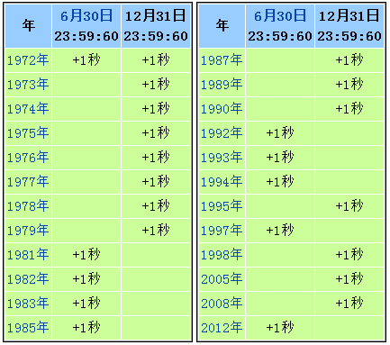

UTC，即协调世界时，是目前国际上最常用的标准时间。我们日常使用的北京时间、服务器时间、GNSS 接收机输出时间、通信系统时间同步等，很多都直接或间接以 UTC 为基础。UTC 看起来只是一个普通的时间标准，但它内部有一个比较特殊的机制：闰秒。

闰秒的作用，是让 UTC 既能保持原子钟的高精度，又不至于和地球自转所决定的天文时间偏离太多。简单来说，UTC 不是完全连续、永远均匀递增的时间尺度，它在必要时会额外增加或减少一秒。这一秒，就是闰秒。

## 为什么 UTC 需要闰秒

现代时间系统主要依赖原子钟。原子钟定义的“秒”非常稳定，适合用于通信、导航、金融、电力、计算机系统等高精度场景。基于原子钟形成的国际原子时，简称 TAI，是一个连续、均匀的时间尺度。它不会因为地球自转变快或变慢而调整。

但是，人类日常生活中的时间概念，最早来自地球自转。一天之所以被理解为24小时，本质上是因为地球相对于太阳完成了一次自转。问题在于，地球自转并不是完全稳定的。潮汐作用、大气运动、海洋运动、地核和地幔之间的相互作用，都会让地球自转速度发生细微变化。长期来看，地球自转还存在缓慢变慢的趋势。

这就产生了一个矛盾：原子钟时间非常稳定，但地球自转时间并不完全稳定。如果 UTC 完全跟随原子钟，那么它会越来越偏离地球自转所代表的天文时间；如果 UTC 完全跟随地球自转，又无法满足现代工程系统对稳定时间尺度的需求。

因此，UTC 采用了一种折中方式：秒长保持为稳定的原子秒，但通过闰秒机制，让 UTC 与地球自转时间之间的偏差保持在一定范围内。



2012 年之前的闰秒插入事件。

## 闰秒的工作模式

闰秒不是像闰年那样按照固定公式出现的。闰年可以提前根据年份规则计算，但闰秒必须根据地球自转的实际观测结果决定。当地球自转时间与 UTC 之间的差值接近规定上限时，国际机构会发布公告，决定是否在 UTC 中加入或删除一秒。

最常见的情况是增加一秒，也叫**正闰秒**。正闰秒通常安排在 UTC 时间 6 月 30 日或 12 月 31 日的最后一分钟。例如一次正闰秒发生时，UTC 时间会这样变化：

```text
23:59:58
23:59:59
23:59:60
00:00:00
```

平时一分钟只有 60 秒，从 00 秒到 59 秒。但在正闰秒发生时，会额外出现一个 `23:59:60`。这意味着当天不再是通常的 86400 秒，而是 86401 秒。

理论上也存在负闰秒，也就是从 UTC 中删除一秒。如果发生负闰秒，某一分钟可能会从 `23:59:58` 直接跳到 `00:00:00`，中间的 `23:59:59` 被省略。这样当天就只有 86399 秒。不过，从 UTC 闰秒制度建立以来，实际发生过的都是正闰秒，负闰秒目前还没有真正出现过。

目前，最近一次闰秒发生在 2016 年 12 月 31 日。自那以后，UTC 没有再插入新的闰秒。当前国际原子时 TAI 比 UTC 快 37 秒，也可以说 UTC 与 TAI 之间存在 37 秒的差值。

## 对 GNSS 和授时系统的影响

闰秒在普通生活中几乎没有存在感，但在 GNSS、授时、通信和仿真测试系统中非常重要。原因是这些系统内部使用的时间尺度不一定都是 UTC。

以 GPS 为例，GPS 时间是一个连续时间尺度，它不像 UTC 一样插入闰秒。GPS 时间在系统建立时与 UTC 有明确关系，但随着 UTC 不断插入闰秒，GPS 时间和 UTC 之间逐渐产生了固定偏移。当前 GPS 时间比 UTC 快 18 秒。

这意味着，GNSS 接收机在解算和输出时间时，必须正确处理系统时间与 UTC 之间的偏移关系。接收机内部可能使用 GPS Time、BeiDou Time、Galileo System Time 等时间尺度，但最终输出给用户或上层系统的往往是 UTC 时间或本地时间。如果导航电文中的闰秒参数、UTC 偏移参数配置错误，接收机输出的时间就可能出现整秒级偏差。

在 GNSS 仿真系统中，这一点同样重要。模拟器生成 RF 信号时，需要按照对应卫星系统的时间规则生成导航电文。如果模拟场景中的闰秒设置不正确，接收机可能会根据错误的 UTC 偏移进行时间换算。对于普通定位测试来说，这种错误不一定马上表现为空间位置异常；但对于授时测试、多设备同步、日志对齐、HIL 闭环验证、事件回放等场景，整秒级时间偏差会直接影响测试结果的可信度。

因此，在 GNSS 测试和仿真中，闰秒不是一个可以忽略的参数。它关系到接收机输出时间是否正确，也关系到仿真环境与真实卫星系统时间关系是否一致。

## 工程系统为什么容易在闰秒处出问题

闰秒对工程系统的挑战，主要来自它打破了很多默认假设。

很多软件系统默认一分钟永远是 60 秒，一天永远是 86400 秒，时间戳永远单调递增。但闰秒出现时，这些假设都可能不成立。正闰秒会让某一天多出一秒，负闰秒则会让某一天少一秒。如果系统没有专门处理，就可能出现时间戳重复、日志乱序、任务调度异常、数据库记录时间不一致等问题。

例如，在正闰秒发生时，如果系统无法表示 `23:59:60`，它可能会把这一秒映射成 `23:59:59`。这样，两个不同的真实时刻就可能拥有相同的时间戳。对于日志分析、交易系统、分布式消息队列、故障回放来说，这会造成明显问题。

还有一些系统会采用“平滑闰秒”的方式，也就是不在某一瞬间突然增加一秒，而是在一段时间内逐渐调整时钟频率，把这一秒慢慢摊开。这种方式可以避免时间突然跳变，但不同厂商、不同云平台的平滑策略可能不同。如果多个系统之间需要高精度同步，混用不同策略也会带来时间不一致的问题。

因此，闰秒本身虽然只有一秒，但它暴露的是系统对时间连续性、时间同步策略和时间尺度选择的依赖。

## 工程实践建议

UTC 中的闰秒机制，本质上是为了协调两类时间：一种是原子钟提供的稳定时间，另一种是地球自转决定的天文时间。UTC 采用原子秒作为基本单位，同时通过闰秒让自身不要过度偏离地球自转时间。

对于普通用户来说，闰秒几乎没有直接影响；但对于 GNSS、授时系统、通信系统、分布式计算、金融交易、仿真测试等工程场景来说，闰秒可能带来时间戳重复、时间跳变、日志乱序、同步误差等问题。

因此，在技术系统中，不能简单地把 UTC 理解为完全连续的秒计数。更合理的做法是明确区分 UTC、TAI、GPS Time 等不同时间尺度：

1. 内部计算尽量使用连续时间尺度。
2. 对外显示和数据交换时，再转换为 UTC 或本地时间。
3. 保持系统中的闰秒表更新。
4. 在 GNSS、授时、HIL、日志回放等关键测试中，单独验证闰秒场景下的表现。

只有这样，才能保证时间同步体系在边界情况下仍然可靠。

