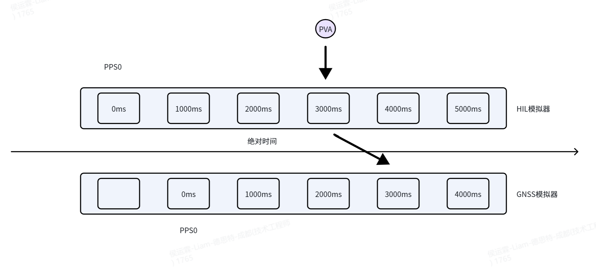

---
title: 局域网内 Windows 与 Linux 时间同步配置
date: 2026-06-26
author: Liam
summary: 面向 HIL、GNSS 仿真和 PVA 数据发送场景，说明为什么多机系统需要同步 PPS0 时间，并给出 Linux chrony 作为局域网 NTP 服务器、Windows 作为客户端的配置与验证方法。
tags: NTP, 时间同步, GNSS, Linux
cover: satellite.webp
---

在 HIL（Hardware-in-the-Loop）测试、GNSS 仿真、实时轨迹注入、PVA 数据发送等场景中，不同主机之间的系统时间必须尽可能一致。

如果发送端主机和 Skydel 所在主机的系统时间不同步，**会影响 PPS0 时间戳的标定，即两台主机的 PPS0 时间戳不一致**。PVA 数据中的时间戳会相对于 Skydel 当前系统时间产生偏移。即使网络传输本身没有明显延迟，Skydel HIL 图中也可能出现几十毫秒、几百毫秒，甚至 1000 ms 以上的异常偏移。

例如，在同一台主机上运行 Python 脚本时，PVA 发送端和 Skydel 使用同一个系统时钟，因此 HIL 图显示正常；但如果改为两台未同步时间的主机，一台发送坐标，一台运行 Skydel，就可能出现 HIL 图右侧条状高度或位置异常。

## PPS0 标定的作用

下面用一个例子说明两台主机 PPS0 不一致时如何导致延迟。



假设 HIL 模拟器和 GNSS 模拟器的 PPS0 时间没有对齐，当 HIL 模拟器在仿真 3000 ms 时发送一个 PVT 数据，会产生以下结果：

1. HIL 模拟器认为自己当前正处于相对于 PPS0 之后 3000 ms 的时刻，因此将 PVT 数据中的 `elapsed time` 标定为 3000 ms。
2. GNSS 模拟器认为自己当前正处于相对于 PPS0 之后 2000 ms 的时刻，但此时收到的 PVT 数据 `elapsed time` 标定为 3000 ms（暂且不考虑网络延迟）。
3. GNSS 模拟器认为 RF 信号不应该立即生成。准确地说，不应该立即根据该 PVT 使用 Skydel 引擎计算 IQ 数据，而是需要再等 1000 ms 才生成该 PVT 对应的 RF 信号。
4. 系统因此表现为较大的延迟。

因此，在多机 HIL 测试前，必须先完成局域网内的时间同步。**PPS0 未同步是延迟的主要来源**。

## HIL 性能分析

HIL 的性能主要通过**延迟性能**和**轨迹抖动性能**来评判。假设 PPS0 已经同步，那么：

1. 真正的延迟取决于**网络延迟**、**采样延迟**、**引擎延迟**之和。这些延迟通常较小，在实际工程中一般处于可接受范围。
2. HIL 仿真不会出现较大延迟，但可能出现 HIL 轨迹抖动、Skydel 引擎吸收 PVA 的效率不高等问题。这个时候需要通过 **Tjoin**、**PVA 采样频率**、**引擎延迟**三个参数进行调节。

本文主要讨论 PPS0 如何标定，以提升 HIL 延迟性能。

## NTP 基本概念

NTP（Network Time Protocol）是一种时间同步协议，用于在网络中同步多台设备的系统时间。其时间同步精度通常能达到几个毫秒级别。若需要更高精度的时间同步机制，需要采用专业的 PTP 协议。

NTP 的优点是不需要额外的时钟服务器或额外硬件，就可以在局域网内实现两台主机之间系统时间的同步。

### chrony

chrony 是 Linux 下常用的 NTP 时间同步工具，主要包含两个组件：

```text
chronyd
chronyc
```

其中：

```text
chronyd：后台时间同步服务
chronyc：命令行查询和控制工具
```

chrony 可以让 Linux 主机同步外部 NTP 服务器，也可以让 Linux 主机作为局域网 NTP 服务器，供 Windows 或其他 Linux 主机同步。

### Windows Time Service

Windows 使用 Windows Time 服务进行时间同步，常用命令为：

```powershell
w32tm
```

常见用途包括：

```powershell
w32tm /query /source
w32tm /query /status
w32tm /stripchart /computer:<目标IP>
w32tm /config /manualpeerlist:<目标NTP服务器>
```

## Windows 同步 Linux

本方案中，Linux 主机作为局域网 NTP 服务器，Windows 主机作为 NTP 客户端同步 Linux 时间。

这种结构适用于：**Windows 上运行 PVA / HIL 发送脚本，Linux 上运行 Skydel**。

### Linux 端安装 chrony

在 GNSS 模拟器中执行：

```bash
sudo apt update
sudo apt install chrony -y
sudo systemctl enable --now chrony
```

检查 chrony 服务状态：

```bash
systemctl status chrony
chronyc tracking
```

### Linux 端配置局域网 NTP 服务器

编辑配置文件：

```bash
sudo nano /etc/chrony/chrony.conf
```

在文件末尾加入：

```conf
allow 192.168.xx.0/24 # 这里修改为 Linux 主机实际所在网段
local stratum 10
```

`allow 192.168.xx.0/24` 表示允许 `192.168.xx.x` 网段内的设备向这台 Linux 请求 NTP 时间。

`local stratum 10` 表示即使 Linux 没有外部 NTP 源，也允许它作为本地时间源对外提供时间。

需要注意：这种情况下，Windows 和 Linux 之间可以保持相互一致，但 Linux 本身的绝对 UTC 时间不一定准确。

### 重启 chrony 并放行 NTP 端口

配置完成后重启服务：

```bash
sudo systemctl restart chrony
```

检查状态：

```bash
chronyc tracking
chronyc sources -v
```

由于 NTP 使用 UDP 123 端口，需要 Linux 防火墙放行：

```bash
sudo ufw allow 123/udp
sudo ufw reload
```

### Windows 端配置同步 Linux

在 Windows 上，以管理员身份打开 CMD 或 PowerShell。

执行：

```powershell
w32tm /config /manualpeerlist:"192.168.xx.xx,0x9" /syncfromflags:manual /update
```

其中 `192.168.xx.xx` 需要替换为 Linux 主机 IP。

然后配置更短的轮询间隔：

```powershell
reg add HKLM\SYSTEM\CurrentControlSet\Services\W32Time\TimeProviders\NtpClient /v SpecialPollInterval /t REG_DWORD /d 16 /f
reg add HKLM\SYSTEM\CurrentControlSet\Services\W32Time\Config /v MinPollInterval /t REG_DWORD /d 4 /f
reg add HKLM\SYSTEM\CurrentControlSet\Services\W32Time\Config /v MaxPollInterval /t REG_DWORD /d 4 /f
```

重启 Windows Time 服务：

```powershell
net stop w32time
net start w32time
```

尝试重新同步：

```powershell
w32tm /resync /rediscover
```

部分 Windows 版本不支持 `/force` 参数。如果执行：

```powershell
w32tm /resync /rediscover /force
```

出现：

```text
下列参数是意外的: /force
发生下列错误: 参数错误。 (0x80070057)
```

则应改用：

```powershell
w32tm /resync /rediscover
```

### Windows 配置检查

配置完成之后，在 Windows 上执行：

```powershell
w32tm /query /source
```

期望输出类似：

```text
192.168.xx.x,0x9
```

这里应显示 Linux 主机 IP。

再执行：

```powershell
w32tm /query /status
```

重点关注：

```text
源
引用 ID
上次成功同步时间
轮询间隔
根分散
```

理想情况下应看到：

```text
源: 192.168.xx.x,0x9
引用 ID: xxx
轮询间隔: 4 (16s)
```

### 时间误差测试

全部配置完成之后，最后验证两台主机的系统时间误差是否已经进入较小范围。

在 Windows 上执行：

```powershell
w32tm /stripchart /computer:192.168.xx.x /period:1 /samples:60 /dataonly
```

示例输出：

```text
17:16:16, +00.0005474s
17:16:17, +00.0005767s
17:16:18, -00.0007171s
17:16:19, -00.0003211s
17:16:20, +00.0001376s
```

这些结果表示 Windows 相对于 Linux 的时间偏差。

换算关系：

```text
+00.0010000s = +1 ms
+00.1000000s = +100 ms
+01.0000000s = +1000 ms
```

如果看到：

```text
+00.0005s
-00.0007s
+00.0013s
```

说明 Windows 和 Linux 误差约为 1 ms，已经非常好。

如果看到：

```text
+00.183s
-00.250s
```

说明误差在 183 ms 到 250 ms 量级，对 HIL 来说偏大。

在 Linux 主机上，也可以查看 Windows 是否作为客户端连到 Linux：

```bash
sudo chronyc -n clients
```

该命令会输出 Windows 主机的 IP。
