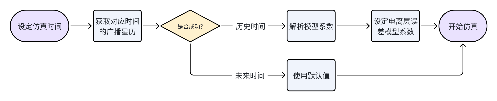
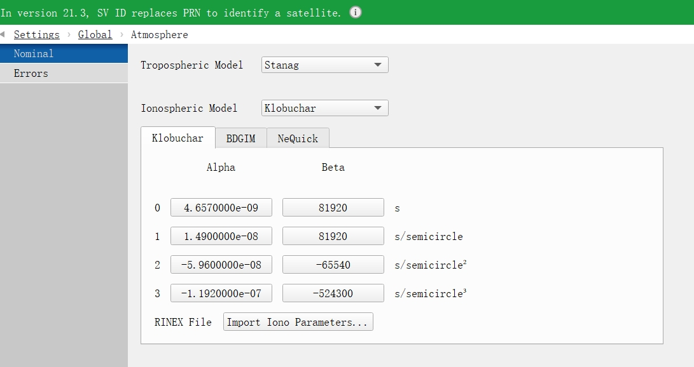
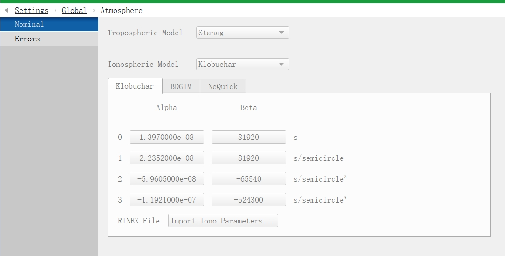

## GNSS 仿真中的电离层模型

GNSS 仿真软件通常支持对任意历史时间或未来时间的卫星信号进行仿真。为了模拟真实信号在传播过程中受到的电离层影响，仿真软件一般也会内置不同类型的电离层模型。但电离层状态并不是固定不变的，它会随着时间、空间位置、太阳活动以及地磁条件等因素发生变化。因此，在不同日期、不同时间下，对应的电离层改正参数也会有所不同。如果仿真过程中始终使用一组固定的默认参数，就很难反映某一天、某一时刻的真实电离层状态。

以 Skydel 为例，Skydel 内置了多种电离层模型，可以用于在仿真信号中加入电离层误差。但在一般情况下，仿真场景使用的是软件提供的默认参数。这些默认参数能够满足一般性的功能测试，但如果目标是准确复现某个历史时间的真实 GNSS 信号环境，默认参数就会带来一定程度的仿真失真。

在真实 GNSS 系统中，电离层误差修正系数通常由地面控制系统根据当前电离层环境进行估计，并注入到卫星中。卫星随后通过导航电文将这些参数播发给接收机。接收机解析导航电文后，再结合对应的电离层模型对观测量进行电离层延时改正。这些随导航电文播发的电离层参数，也会随着历史星历文件被记录下来。也就是说，对于历史时间仿真，我们并不一定只能使用仿真软件的默认参数，而是可以根据指定的仿真日期获取对应的星历文件，从中解析出当时真实播发的电离层改正参数。

## 整体流程

那么我们就可以设计出以下这样的流程来自动化选择电离层模型参数：



- 如果是历史时间仿真，则优先获取对应日期的广播星历，并从中解析电离层参数；
- 如果是未来时间仿真，则由于无法获取真实星历，回退使用 Skydel 默认参数；
- 最后通过 Skydel API 将选定的模型和参数写入仿真场景。

### 1. Skydel 相关 API

Skydel 支持对任意历史时间或未来时间的 GNSS 信号进行仿真，同时也提供了用于配置电离层模型的 API。开发者可以通过这些接口自定义电离层误差参数，从而实现更加灵活的仿真控制，我们可以借助这些 API 让我们上述的仿真流程自动化。Skydel 中与电离层误差相关的基础 API 主要包括：

- `SetIonoModel(model: Literal["None", "Klobuchar", "Spacecraft", "NeQuick"])`：设定是否要开启电离层误差或指定电离层误差模型
- `SetIonoAlpha(index: Literal[0, 1, 2, 3], value: float)`：用于指定 Klobuchar 模型中的 4 个 alpha 系数
- `SetIonoBeta(index: Literal[0, 1, 2, 3], value: float)`：用于指定 Klobuchar 模型中的 4 个 beta 系数
- `SetIonoBdgimAlpha(index: Literal[1, 2, 3, 4, 5, 6, 7, 8, 9], value: float)`：用于指定 BDGIM 模型中的 9 个系数
- `SetEffectiveIonisationLevelCoefficient(index: Literal[0, 1, 2], val: float)`：用于指定 NeQuick 模型中的 3 个系数

### 2. 获取广播星历

全世界各地的 IGS 平台都会收集每日/每时刻的广播星历，并对用户公开。在国内较为完善的平台是[武汉大学 IGS 数据中心](http://www.igs.gnsswhu.cn/index.php)，提供了网页和 FTP 下载，这里使用 FTP 渠道。广播星历文件遵循 RINEX 格式文件的命名规则，例如 2025 年 8 月 1 日的广播星历为 `ftp://igs.gnsswhu.cn/pub/gps/data/daily/2025/brdc/BRDM00DLR_S_20252120000_01D_MN.gz`

其中最为主要的是以下两项参数，有了这两项参数就能确定当日的广播星历，其他参数主要用于标识发布机构等内容，不作过多深究：

- `2025`：`年份`
- `20252120000`：`<年份><3 位的年积日>0000`

```python
# 指定仿真的时间，此处为 2025 年 8 月 1 日 7 时
DATA_TIME = datetime.datetime(2025, 8, 1, 7, 0, 0)

# 将仿真时间转为年积日的整数
def get_doy(date: datetime.datetime) -> int:
    start_of_year = datetime.datetime(date.year, 1, 1, 0, 0, 0)
    return (date - start_of_year).days

# 通过 FTP URL 下载指定的文件
def download_ftp_file(host: str, remote_file_path: str, local_file_path: str) -> bool:
    try:
        with FTP(host) as ftp:
            ftp.login()

            remote_dir = os.path.dirname(remote_file_path)
            remote_filename = os.path.basename(remote_file_path)

            if remote_dir:
                ftp.cwd(remote_dir)

            os.makedirs(os.path.dirname(local_file_path), exist_ok=True)

            file_size = ftp.size(remote_filename)
            with open(local_file_path, "wb") as local_file:
                if file_size:
                    with tqdm(
                        total=file_size,
                        unit="B",
                        unit_scale=True,
                        desc="Download",
                        ncols=100,
                    ) as pbar:

                        def progress_callback(data):
                            local_file.write(data)
                            pbar.update(len(data))

                        ftp.retrbinary(f"RETR {remote_filename}", progress_callback)
                else:
                    ftp.retrbinary(f"RETR {remote_filename}", local_file.write)

            print(f"[INFO] 文件 {remote_file_path} 已成功下载到 {local_file_path}")
            return True

    except Exception as e:
        print(f"[ERROR] 下载失败: {str(e)}")
        return False

# 解压缩 .gz 文件，因为广播星历都需要解压后才能得到 RINEX 文件
def extract_gz_file(file_path: str) -> Optional[str]:
    file_dir = os.path.dirname(file_path)
    file_name = os.path.basename(file_path)

    folder_name = file_name[:-3] if file_name.endswith(".gz") else file_name
    output_folder = os.path.join(file_dir, folder_name)
    os.makedirs(output_folder, exist_ok=True)

    output_file_name = folder_name
    output_file_path = os.path.join(output_folder, output_file_name)

    try:
        with (
            gzip.open(file_path, "rb") as gz_file,
            open(output_file_path, "wb") as output_file,
        ):

            output_file.write(gz_file.read())

        print(f"[INFO] 文件已解压至: {output_file_path}")
        return output_file_path

    except Exception as e:
        print(f"[ERROR] 解压失败: {str(e)}")
        return None

# 通过仿真时间获取对应的广播星历 RINEX 文件
def fetch_rinex(save_dir: str) -> Optional[str]:
    host = "igs.gnsswhu.cn"
    # 通过仿真时间的年份和年积日拼接目标 FTP URL
    remote_path = f"pub/gps/data/daily/{DATA_TIME.year}/brdc/BRDM00DLR_S_{DATA_TIME.year}{get_doy(DATA_TIME):03d}0000_01D_MN.rnx.gz"
    save_path = os.path.join(save_dir, os.path.basename(remote_path))
    # 下载并解压缩
    if download_ftp_file(host, remote_path, save_path):
        return extract_gz_file(save_path)
    return None
```

### 3. 解析电离层模型系数

我们所需要的电离层改正信息存储在广播星历 RINEX 文件 HEADER 部分的 IONOSPHERIC CORR 字段下：

```text
     3.04           NAVIGATION DATA     M                   RINEX VERSION / TYPE
BCEmerge            congo               20250801 005005 GMT PGM / RUN BY / DATE 
Merged GPS/GLO/GAL/BDS/QZS/SBAS/IRNSS navigation file       COMMENT 
based on CONGO and IGS tracking data                        COMMENT 
DLR/GSOC: O. Montenbruck; P. Steigenberger                  COMMENT 
GPSA   1.3970e-08  2.2352e-08 -5.9605e-08 -1.1921e-07       IONOSPHERIC CORR    
GPSB   1.1059e+05  1.3107e+05 -6.5536e+04 -2.6214e+05       IONOSPHERIC CORR    
GAL    1.4825e+02 -6.6406e-02  1.4954e-02                   IONOSPHERIC CORR    
BDSA   2.2352e-08  2.0117e-07 -1.4901e-06  2.1458e-06       IONOSPHERIC CORR    
BDSB   1.2493e+05 -3.6045e+05  2.4904e+06 -1.7039e+06       IONOSPHERIC CORR    
QZSA   1.6764e-08  7.4506e-09 -2.9802e-07 -6.5565e-07       IONOSPHERIC CORR    
QZSB   1.4336e+05  1.6384e+05 -3.9322e+05 -5.2429e+05       IONOSPHERIC CORR    
IRNA   4.6566e-08  2.7567e-07 -1.2517e-06 -7.5102e-06       IONOSPHERIC CORR    
IRNB   2.2528e+05 -9.1750e+05 -1.9661e+05  8.3231e+06       IONOSPHERIC CORR    
BDUT -1.8626451492e-09-9.769962617e-15     14 2377          TIME SYSTEM CORR    
GAGP  1.1350493878e-09 6.661338148e-15 432000 2377          TIME SYSTEM CORR    
GAUT  0.0000000000e+00 0.000000000e+00 345600 2377          TIME SYSTEM CORR    
GLGP -5.5879354477e-09 0.000000000e+00 345600 2377          TIME SYSTEM CORR    
GLUT -9.3132257462e-10 0.000000000e+00 345600 2377          TIME SYSTEM CORR    
GPUT  0.0000000000e+00-1.776356839e-15  61440 2378          TIME SYSTEM CORR    
IRGA  4.7148205340e-09 1.376676551e-14 430800 2377          TIME SYSTEM CORR    
IRGL  1.1379597709e-08-2.398081733e-14 430800 2377          TIME SYSTEM CORR    
IRGP -1.4842953533e-09 1.243449788e-14 430800 2377          TIME SYSTEM CORR    
IRUT  9.1386027634e-09-2.575717417e-14 430800 2377          TIME SYSTEM CORR    
QZUT -3.7252902985e-09 0.000000000e+00   8192 2378          TIME SYSTEM CORR    
    18    18  1929     7                                    LEAP SECONDS        
                                                            END OF HEADER       
```

可以看出，广播星历中包含了多种卫星的电离层改正信息，如 BDSA 用于北斗、GAL 用于 Galileo 等。目标的 Klobuchar 就存储在 GPSA 和 GPSB 字段下，GPSA 为 alpha 系数，GPSB 为 beta 系数

```python
# 解析 RINEX 文件中的 Klobuchar 参数的简单实现
def parse_klobuchar_coefficient(rinex_path: str):
    alpha_line, beta_line = None, None
    with open(rinex_path, "r") as f:
        while True:
            if alpha_line is not None and beta_line is not None:
                break

            line = f.readline().strip()

            # 直接去寻找 IONOSPHERIC CORR 和 GPSA/GPSB 字段
            if line.endswith("IONOSPHERIC CORR") and line.startswith("GPSA"):
                alpha_line = line.strip("IONOSPHERIC CORR").strip("GPSA").strip()

            if line.endswith("IONOSPHERIC CORR") and line.startswith("GPSB"):
                beta_line = line.strip("IONOSPHERIC CORR").strip("GPSB").strip()

            continue

    # 将 alpha 与 beta 转换为 float 类型并返回
    alpha = tuple(map(float, alpha_line.split()))
    beta = tuple(map(float, beta_line.split()))

    return alpha, beta
```

### 4. 执行仿真

整个 demo 的实现过程如下：

```python
if __name__ == "__main__":
    # 下载对应的 rinex 文件并解析其中的 alpha 和 beta 电离层改正系数
    try:
        alpha, beta = parse_klobuchar_coefficient(fetch_rinex("data"))
    except:
        alpha, beta = None, None
    print(f"[INFO] 解析得到的 Alpha 参数为 {alpha}，Beta 参数为 {beta}")

    # 连接 Skydel Server
    sim = skydelsdx.RemoteSimulator()
    sim.setVerbose(True)
    sim.connect(IP_ADDR)
    sim.call(cmd.New(True))

    # 设置 Skydel 输出信号
    sim.call(cmd.SetModulationTarget("NoneRT", "", "", True, "uniqueId"))
    sim.call(
        cmd.ChangeModulationTargetSignals(
            0, 12500000, 100000000, "UpperL", "L1CA", -1, False, "uniqueId"
        )
    )
    
    # 设置电离层误差模型为 Klobuchar 并使用下载星历中的系数设置
    sim.call(cmd.SetIonoModel("Klobuchar"))
    if alpha is not None and beta is not None:
        for index, param in enumerate(alpha):
            sim.call(cmd.SetIonoAlpha(index, param))
        for index, param in enumerate(beta):
            sim.call(cmd.SetIonoBeta(index, param))

    # 设定轨迹并运行仿真
    sim.call(
        cmd.SetVehicleTrajectoryCircular(
            "Circular", 0.7853995339022749, -1.2740964277717111, 0, 50, 3, True
        )
    )
    sim.call(cmd.SetGpsStartTime(DATA_TIME))

    sim.arm()
    sim.start()

    sim.stop(120)
    sim.disconnect()
```

运行脚本后有如下输出，可以发现脚本根据指定的仿真日期自动下载并解析了 Klobuchar 模型的改正系数：

```shell
$ python .\src\auto_iono_model.py
Download: 100%|████████████████████████████████████████████████| 1.40M/1.40M [00:32<00:00, 43.3kB/s]
[INFO] 文件 pub/gps/data/daily/2025/brdc/BRDM00DLR_S_20252120000_01D_MN.rnx.gz 已成功下载到 data\BRDM00DLR_S_20252120000_01D_MN.rnx.gz
[INFO] 文件已解压至: data\BRDM00DLR_S_20252120000_01D_MN.rnx\BRDM00DLR_S_20252120000_01D_MN.rnx
[INFO] 解析得到的 Alpha 参数为 (1.397e-08, 2.2352e-08, -5.9605e-08, -1.1921e-07)，Beta 参数为 (110590.0, 131070.0, -65536.0, -262140.0)
Connecting to 192.168.81.162 on port 4820...
Call New(DiscardCurrentConfig: True, LoadDefaultConfig: None) => Success
Call SetModulationTarget(Type: NoneRT, Path: , Address: , ClockIsExternal: True, Id: uniqueId) => Success
Call ChangeModulationTargetSignals(Output: 0, MinRate: 12500000, MaxRate: 100000000, Band: UpperL, Signal: L1CA, Gain: -1, GaussianNoise: False, Id: uniqueId, CentralFrequency: None) => Success
Call SetIonoModel(Model: Klobuchar) => Success
Call SetIonoAlpha(Index: 0, Val: 1.397e-08) => Success
Call SetIonoAlpha(Index: 1, Val: 2.2352e-08) => Success
Call SetIonoAlpha(Index: 2, Val: -5.9605e-08) => Success
Call SetIonoAlpha(Index: 3, Val: -1.1921e-07) => Success
Call SetIonoBeta(Index: 0, Val: 81920.0) => Success
Call SetIonoBeta(Index: 1, Val: 81920.0) => Success
Call SetIonoBeta(Index: 2, Val: -65540.0) => Success
Call SetIonoBeta(Index: 3, Val: -524300.0) => Success
Call SetVehicleTrajectoryCircular(Type: Circular, Lat: 0.7853995339022749, Lon: -1.274096427771711, Alt: 0, Radius: 50, Speed: 3, Clockwise: True, OriginAngle: None) => Success
Call SetGpsStartTime(Start: 2025-08-01 07:00:00) => Success
Arming simulation...
Simulation armed.
Starting simulation...
Simulation started.
Stopping simulation at 120 seconds...
Simulation stopped.
Commands Client Disconnecting
```

打开 Skydel 界面 Settings - Global - Atmosphere，也可以看到在运行自动化流程后， Klobuchar 模型系数已经变成广播星历中的历史真实数值：

Skydel 中的 Klobuchar 模型默认系数：




自动获取的真实 Klobuchar 模型系数：


