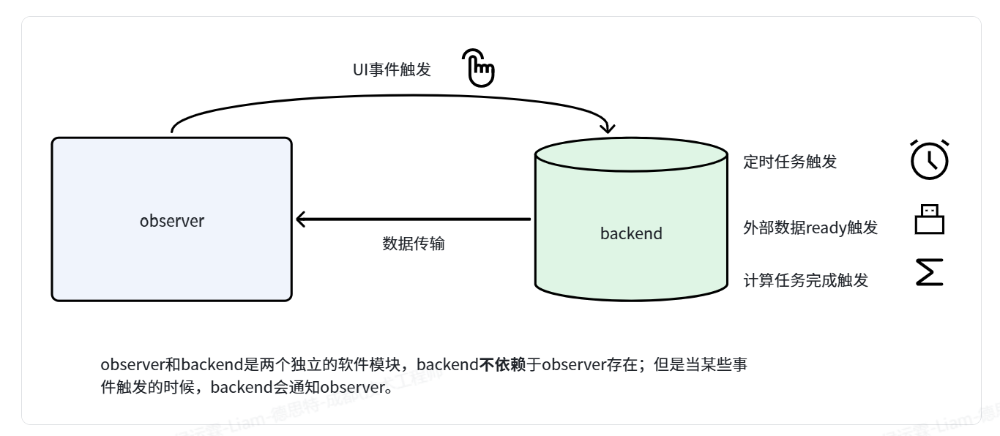

消息推送广泛用于事件监听、UI 绑定、即时通信、订单状态更新、监控告警和物联网数据上报等场景。本文先从单机应用中的观察者模式入手，再介绍如何通过 HTTP 流式响应将同样的“状态变化后主动通知”思路扩展到客户端与服务端之间。

## 一、观察者模式

在单个计算机应用内部，通常使用**观察者模式**实现对象之间的状态通知。例如：

- 用户点击按钮后，系统向相关组件发送事件消息，触发数据提交、页面跳转或弹窗展示。
- 后台数据发生变化后，系统主动通知前端更新界面，使用户及时看到最新内容。
- 即时通信应用将新消息实时推送给在线用户。
- 电商系统在订单状态变化后推送付款成功、商品发货或订单完成等通知。
- 监控系统在服务器、网络设备或业务指标异常时及时推送告警。
- 物联网平台在设备状态或传感器数据变化后，将最新数据推送给管理端。

一个典型的事件触发关系如下：



其中，`Backend` 是负责核心业务的独立模块。它可能执行以下任务：

- 执行定时任务，并在到达预定时间点后记录相关信息。
- 处理串口等外部数据，并将处理结果发送给观察者。
- 执行深度神经网络训练或推理等 CPU 密集型任务，并在完成后返回结果。
- 响应 UI 点击事件，执行相应逻辑并同步更新后端数据。

观察者知道 `Backend` 的存在，但 `Backend` 不需要知道具体观察者是谁。这类似于收音机知道广播电台的频段，而广播电台不知道有哪些收音机正在收听；导航卫星广播导航数据，却不知道地面上有哪些 GPS 接收机正在接收信号。

为了避免模块间形成紧耦合，观察者可以提前向 `Backend` 注册一段回调逻辑。当事件发生时，`Backend` 只负责调用已经注册的回调，而不依赖观察者的具体实现：

```python
import random
import time
from collections.abc import Callable


class Backend:
    def __init__(self) -> None:
        self.logic: Callable[[int], None] | None = None

    def insert_logic(self, logic: Callable[[int], None]) -> None:
        self.logic = logic

    def some_task(self) -> int:
        time.sleep(3)  # 模拟计算任务
        data = random.randint(0, 100)
        if self.logic is not None:
            self.logic(data)
        return data


class Observer:
    def __init__(self) -> None:
        self.backend = Backend()

    def record_data(self, data: int) -> None:
        print(f"已经记录来自 Backend 的数据：{data}")


observer = Observer()
observer.backend.insert_logic(observer.record_data)
observer.backend.some_task()
```

这个示例的本质是使用回调函数。不同技术体系的术语有所不同，但核心思想相同：订阅者预先注册接收逻辑，发布者在事件发生时通知订阅者。

| 技术体系 | 主题或事件 | 订阅 | 发布或通知 | 取消订阅 | 接收者 |
| --- | --- | --- | --- | --- | --- |
| 观察者模式 | Subject | `attach(observer)` / `subscribe()` | `notify()` | `detach(observer)` / `unsubscribe()` | Observer |
| Qt | Signal | `connect()` | `emit` | `disconnect()` | Slot |
| Java Swing / AWT | Event | `addXxxListener()` | `fireXxxEvent()` | `removeXxxListener()` | Listener |
| C# / .NET | Event | `+=` | `Invoke()` | `-=` | EventHandler |
| JavaScript DOM | Event Type | `addEventListener()` | `dispatchEvent()` | `removeEventListener()` | Event Listener |
| Node.js EventEmitter | Event Name | `on()` / `addListener()` | `emit()` | `off()` / `removeListener()` | Listener |
| Python Django Signal | Signal | `connect()` | `send()` | `disconnect()` | Receiver |
| RxJava / RxJS | Observable | `subscribe()` | `onNext()` / `next()` | `dispose()` / `unsubscribe()` | Observer |
| Android LiveData | LiveData | `observe()` | `setValue()` / `postValue()` | `removeObserver()` | Observer |
| Swift NotificationCenter | Notification Name | `addObserver()` | `post()` | `removeObserver()` | Observer |
| MQTT | Topic | `subscribe()` | `publish()` | `unsubscribe()` | Subscriber |
| Kafka | Topic | `subscribe()` | `send()` / `produce()` | `unsubscribe()` | Consumer |
| Redis Pub/Sub | Channel | `SUBSCRIBE` | `PUBLISH` | `UNSUBSCRIBE` | Subscriber |

## 二、JSONL 流式响应

JSONL 流式响应是服务端持续向客户端发送一系列数据的响应方式。借助客户端与服务端之间的异步机制，服务端能够在数据产生时立即“通知”客户端。

JSONL（JSON Lines）中每一行都是一个完整的 JSON 对象，并通过换行符分隔：

```json
{"name": "Plumbus", "description": "A multi-purpose household device."}
{"name": "Portal Gun", "description": "A portal opening device."}
{"name": "Meeseeks Box", "description": "A box that summons a Meeseeks."}
```

响应的 `Content-Type` 通常设置为 `application/jsonl`。客户端异步读取响应体：暂时没有新数据时，读取任务将控制权交还事件循环；新数据到达后，等待中的协程被唤醒并继续处理。

客户端和服务端分别执行以下工作：

- 客户端异步读取接口数据。没有数据到达时不会阻塞线程；数据到达后，通过 `await` 恢复处理。
- 服务端异步写入 HTTP 响应。后端数据没有更新时，发送协程暂停并将控制权交还事件循环；更新通知到达后，协程恢复并发送实际数据。

在 FastAPI 中，路由可以返回异步生成器，从而逐项产生响应数据：

```python
from collections.abc import AsyncIterable

from fastapi import FastAPI
from pydantic import BaseModel

app = FastAPI()


class Item(BaseModel):
    name: str
    description: str | None


items = [
    Item(name="Plumbus", description="A multi-purpose household device."),
    Item(name="Portal Gun", description="A portal opening device."),
    Item(name="Meeseeks Box", description="A box that summons a Meeseeks."),
]


@app.get("/items/stream")
async def stream_items() -> AsyncIterable[Item]:
    for item in items:
        yield item
```

实际项目中，`items` 也可以替换为异步数据源，例如消息队列、数据库游标或后端事件队列。

## 三、Server-Sent Events（SSE）

SSE 的传输方式与 JSONL 流式响应相似，但响应体由一系列事件组成。每个事件包含若干 `字段: 值`，事件之间以空行分隔：

```text
data: {"name": "Portal Gun", "price": 999.99}

data: {"name": "Plumbus", "price": 32.99}

```

除了 `data`，事件还可以包含 `id`、`event` 和 `retry` 等字段。SSE 响应的媒体类型为 `text/event-stream`。

### 服务端实现

在 FastAPI 中，可以用 `StreamingResponse` 包装异步生成器并逐条发送 SSE 消息：

```python
import asyncio
import json
from collections.abc import AsyncGenerator
from datetime import datetime, timezone

from fastapi import FastAPI, Query, Request
from fastapi.responses import StreamingResponse
from pydantic import BaseModel

app = FastAPI()


class StreamItem(BaseModel):
    sequence: int
    message: str
    sent_at: datetime


def format_sse(item: StreamItem) -> str:
    data = json.dumps(item.model_dump(mode="json"), ensure_ascii=False)
    return f"event: item\nid: {item.sequence}\ndata: {data}\n\n"


@app.get(
    "/stream",
    summary="Stream Server-Sent Events",
    response_description="One SSE event per generated item",
)
async def stream_events(
    request: Request,
    count: int = Query(default=5, ge=1, le=100),
    delay: float = Query(default=1.0, ge=0, le=10),
) -> StreamingResponse:
    async def event_generator() -> AsyncGenerator[str, None]:
        for sequence in range(1, count + 1):
            if await request.is_disconnected():
                break

            item = StreamItem(
                sequence=sequence,
                message=f"Item {sequence} of {count}",
                sent_at=datetime.now(timezone.utc),
            )
            yield format_sse(item)

            if sequence < count:
                await asyncio.sleep(delay)

    return StreamingResponse(
        event_generator(),
        media_type="text/event-stream",
        headers={
            "Cache-Control": "no-cache",
            "Connection": "keep-alive",
            "X-Accel-Buffering": "no",
        },
    )
```

这里的 `Cache-Control` 用于避免缓存流式内容，`X-Accel-Buffering: no` 用于提示 Nginx 等代理不要缓冲响应。服务端也会检查客户端是否已经断开，避免继续执行无意义的生成工作。

### 客户端实现

Python 客户端可以通过 `httpx` 逐行读取响应，并在遇到空行时将已经收集的字段组装为一个完整事件：

```python
import json
import time
from collections.abc import AsyncIterator

import httpx


async def iter_sse_events(
    response: httpx.Response,
) -> AsyncIterator[dict[str, str]]:
    event: dict[str, str] = {}
    data_lines: list[str] = []

    async for line in response.aiter_lines():
        if line == "":
            if data_lines:
                event["data"] = "\n".join(data_lines)
                yield event
            event = {}
            data_lines = []
            continue

        if line.startswith(":"):
            continue

        field, _, value = line.partition(":")
        if value.startswith(" "):
            value = value[1:]

        if field == "data":
            data_lines.append(value)
        elif field in {"event", "id", "retry"}:
            event[field] = value


async def consume_events(url: str) -> None:
    started_at = time.perf_counter()

    async with httpx.AsyncClient(timeout=None, trust_env=False) as client:
        async with client.stream(
            "GET",
            url,
            headers={"Accept": "text/event-stream"},
        ) as response:
            response.raise_for_status()
            print(f"content-type: {response.headers['content-type']}")

            async for event in iter_sse_events(response):
                item = json.loads(event["data"])
                elapsed = time.perf_counter() - started_at
                event_name = event.get("event", "message")
                event_id = event.get("id", "-")
                print(f"+{elapsed:0.1f}s {event_name}#{event_id}: {item}")
```

JSONL 和 SSE 都适合服务端单向持续推送。JSONL 的格式更通用，适合程序之间交换连续的结构化数据；SSE 则定义了浏览器友好的事件格式，并原生支持事件名称、事件 ID 和断线重连。选择哪一种方式，应根据客户端能力和业务协议需求决定。
